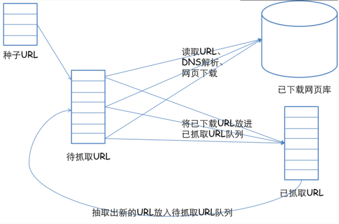
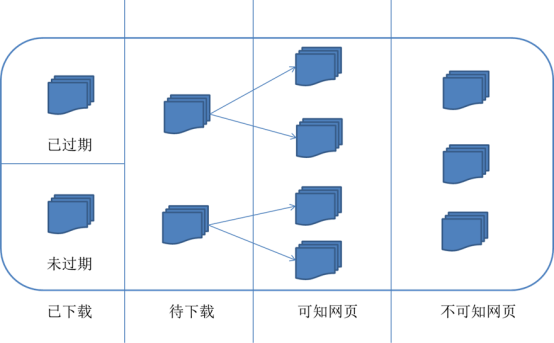
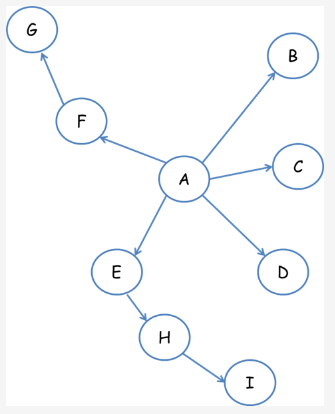
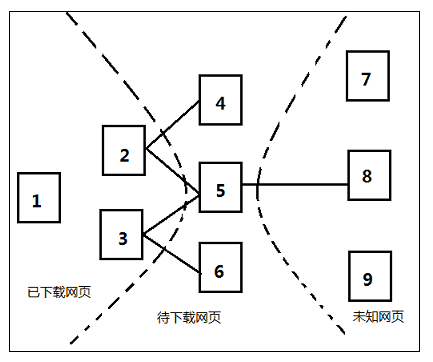

## 1. 什么是爬虫？


爬虫的全称为网络爬虫，简称爬虫，别名有网络机器人，网络蜘蛛等等。

网络爬虫是一种自动获取网页内容的程序，为搜索引擎提供了重要的数据支撑。搜索引擎通过网络爬虫技术，将互联网中丰富的网页信息保存到本地，形成镜像备份。我们熟悉的谷歌、百度本质上也可理解为一种爬虫。

如果形象地理解，爬虫就如同一只机器蜘蛛，它的基本操作就是模拟人的行为去各个网站抓取数据或返回数据。

## 2.爬虫的分类

网络爬虫一般分为传统爬虫和聚焦爬虫。

- 传统爬虫：从一个或若干个初始网页的URL开始，抓取网页时不断从当前页面上抽取新的URL放入队列，直到满足系统的一定条件才停止，即通过源码解析来获得想要的内容。

- 聚焦爬虫：根据一定的网页分析算法过滤与主题无关的链接，保留有用的链接并将其放入待抓取的URL队列，再根据一定的搜索策略从队列中选择下一步要抓取的网页URL，并重复上述过程，直到满足系统的一定条件时停止。另外，所有被爬虫抓取的网页都将会被系统存储、分析、过滤，并建立索引，以便之后的查询和检索;对于聚焦爬虫来说，这一过程所得到的分析结果还可能对以后的抓取过程给出反馈和指导。

> 反爬虫:KS-WAF（网站统一防护系统）将爬虫行为分为搜索引擎爬虫及扫描程序爬虫，可屏蔽特定的搜索引擎爬虫节省带宽和性能，也可屏蔽扫描程序爬虫，避免网站被恶意抓取页面。使用防爬虫机制的基本上是企业，我们平时也能见到一些对抗爬虫的经典方式，如图片验证码、滑块验证、封禁 IP等等。

## 3.爬虫的工作原理

下图是一个网络爬虫的基本框架：



对应互联网的所有页面可划分为五部分：



1. 已下载未过期网页。
2. 已下载已过期网页：抓取到的网页实际上是互联网内容的一个镜像文件，互联网是动态变化的，一部分互联网上的内容已经发生了变化，这时，这部分抓取到的网页就已经过期了。
3. 待下载网页：待抓取URL队列中的页面。
4. 可知网页：既没有被抓取也没有在待抓取URL队列中，但可通过对已抓取页面或者待抓取URL对应页面进行分析获取到的URL，认为是可知网页。
5. 不可知网页：爬虫无法直接抓取下载的网页。

待抓取URL队列中的URL顺序排列涉及到抓取页面的先后次序问题，而决定这些URL排列顺序的方法叫做抓取策略。下面介绍六种常见的抓取策略：

1. 深度优先遍历策略

   深度优先遍历策略是指网络爬虫从起始页开始，由一个链接跟踪到另一个链接，这样不断跟踪链接下去直到处理完这条线路，之后再转入下一个起始页，继续跟踪链接。以下图为例：

   

   遍历路径：A-F-G E-H-I B C D

   > 需要注意的是，深度优先可能会找不到目标节点（即进入无限深度分支），因此，深度优先策略不一定能适用于所有情况。

2. 宽度优先遍历策

   宽度优先遍历策略的基本思路是，将新下载网页中发现的链接直接插入待抓取URL队列的末尾。也就是指网络爬虫会先抓取起始网页中链接的所有网页，然后再选择其中的一个链接网页，继续抓取在此网页中链接的所有网页。还是以上图为例：

   

   遍历路径：第一层：A-B-C-D-E-F，第二层：G-H，第三层：I

   广度优先遍历策略会彻底遍历整个网络图，效率较低，但覆盖网页较广。

3. 反向链接数策

   反向链接数是指一个网页被其他网页链接指向的数量。反向链接数反映一个网页的内容受到其他人推荐的程度。因此，很多时候搜索引擎的抓取系统会使用这个指标来评价网页的重要程度，从而决定不同网页的抓取先后顺序。

   > 而现实是网络环境存在各种广告链接、作弊链接的干扰，使得许多反向链接数反映的结果并不可靠。

4. Partial PageRank策略

   Partial PageRank策略借鉴了PageRank算法的思想：对于已下载网页，连同待抓取URL队列中的URL，形成网页集合，计算每个页面的PageRank值，然后将待抓取URL队列中的URL按照PageRank值的大小进行排列，并按照该顺序抓取页面。

   若每次抓取一个页面，就重新计算PageRank值，则效率太低。

   一种折中方案是：每抓取K个页面后，重新计算一次PageRank值。而对于已下载页面中分析出的链接，即暂时没有PageRank值的未知网页那一部分，先给未知网页一个临时的PageRank值，再将这个网页所有链接进来的PageRank值进行汇总，这样就形成了该未知页面的PageRank值，从而参与排序。以下图为例：

   

   设k值为3，即每抓取3个页面后，重新计算一次PageRank值。

   已知有{1,2,3}这3个网页下载到本地，这3个网页包含的链接指向待下载网页{4,5,6}（即待抓取URL队列），此时将这6个网页形成一个网页集合，对其进行PageRank值的计算，则{4,5,6}每个网页得到对应的PageRank值，根据PageRank值从大到小排序，由图假设排序结果为5,4,6，当网页5下载后，分析其链接发现指向未知网页8，这时先给未知网页8一个临时的PageRank值，如果这个值大于网页4和6的PageRank值，则接下来优先下载网页8，由此思路不断进行迭代计算。

5. OPIC策略

   此算法其实也是计算页面重要程度。在算法开始前，给所有页面一个相同的初始现金（cash）。当下载了某个页面P之后，将P的现金分摊给所有从P中分析出的链接，并且将P的现金清空。对于待抓取URL队列中的所有页面按照现金数大小进行排序。

6. 大站优先策略

   对于待抓取URL队列中的所有网页，根据所属的网站进行分类。待下载页面数多的网站优先下载。

## 二、爬虫的基本流程

首先简单了解关于Request和Response的内容：

Request：浏览器发送消息给某网址所在的服务器，这个请求信息的过程叫做HTTP Request。

Response:服务器接收浏览器发送的消息，并根据消息内容进行相应处理，然后把消息返回给浏览器。这个响应信息的过程叫做HTTP Response。浏览器收到服务器的Response信息后，会对信息进行相应处理，然后展示在页面上。

根据上述内容将网络爬虫分为四个步骤：

1. 发起请求：通过HTTP库向目标站点发起请求，即发送一个Request，请求可以包含额外的headers等信息，等待服务器响应。

   常见的请求方法有两种，GET和POST。get请求是把参数包含在了URL（Uniform Resource Locator,统一资源定位符）里面，而post请求大多是在表单里面进行，也就是让你输入用户名和秘密，在url里面没有体现出来，这样更加安全。post请求的大小没有限制，而get请求有限制，最多1024个字节。

2. 获取响应内容：如果服务器能正常响应，会得到一个Response，Response的内容便是所要获取的页面内容，类型可能有HTML，Json字符串，二进制数据（如图片视频）等类型。

3. 解析内容：得到的内容可能是HTML，可以用正则表达式、网页解析库进行解析。可能是Json，可以直接转为Json对象解析，可能是二进制数据，可以做保存或者进一步的处理。

   在Python语言中，我们经常使用Beautiful Soup、pyquery、lxml等库，可以高效的从中获取网页信息，如节点的属性、文本值等。

   Beautiful Soup库是解析、遍历、维护“标签树”的功能库，对应一个HTML/XML文档的全部内容。安装方法非常简单，如下：

   ```bash
   #安装方法
   pips install beautifulsoup4
   
   #验证方法
   from bs4 import BeautifulSoup
   ```

4. 保存数据：如果数据不多，可保存在txt 文本、csv文本或者json文本等。如果爬取的数据条数较多，可以考虑将其存储到数据库中。也可以保存为特定格式的文件。

5. 保存后的数据可以直接分析，主要使用的库如下：NumPy、Pandas、 Matplotlib。

   > NumPy：它是高性能科学计算和数据分析的基础包。

   > Pandas : 基于 NumPy 的一种工具，该工具是为了解决数据分析任务而创建的。它可以算得上作弊工具。

   > Matplotlib：Python中最著名的绘图系统Python中最著名的绘图系统。它可以制作出散点图，折线图，条形图，直方图，饼状图，箱形图散点图，折线图，条形图，直方图，饼状图，箱形图等。
